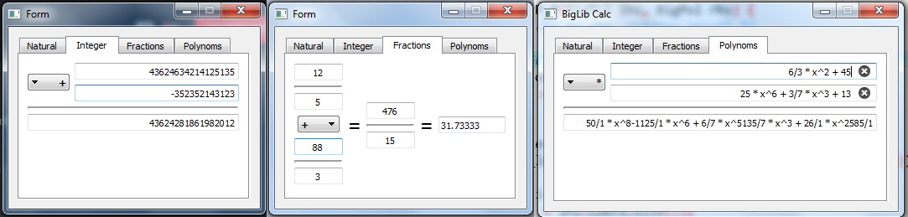

# BigInt
BigInt это библиотека для работы с длинными числами, которую можно использовать как библиотеку для C++ или как исполняемый файл через любой современный язык программирования. 

# TODO

- [X] Класс натральных
- [X] Класс целых
- [X] Разобраться в целых и натральных
- [X] Зарегаться на гитхабе и скинуть свой ник
- [X] Научиться использовать git из консоли
- [X] Создать отдельную ветку для своих разработок
- [X] Реализвать операции сравнения для целых и натуральных
- [X] Реализовать класс дробей
- [X] Перегрузить ввод из потока
- [X] Добавить вывод дроби как float
- [X] Сделать интерфейс и API
- [X] Реализовать класс многочленов
- [X] Расширить API и интерфейс
- [X] Сделать документацию к API
- [ ] Провести тесты
- [ ] Собрать статистику и сделать графики
- [ ] Подготовить выступление

